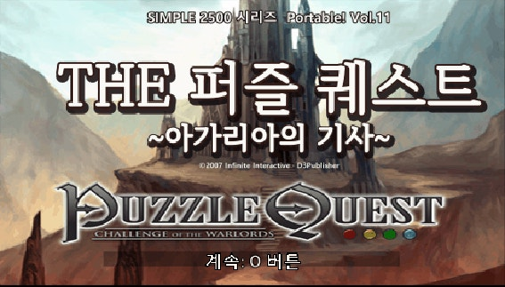
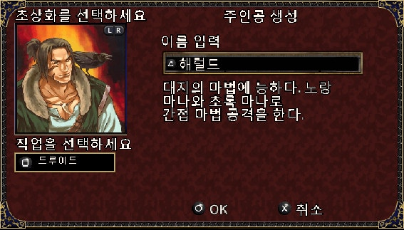
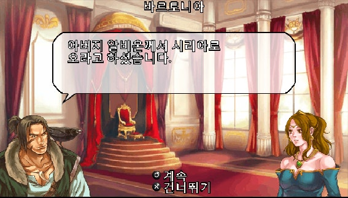
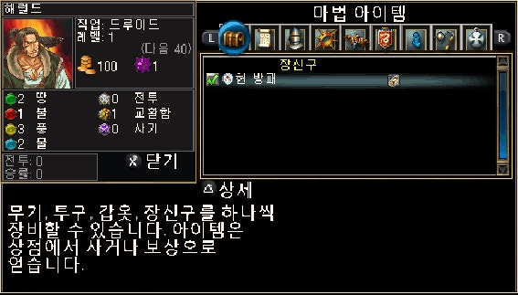
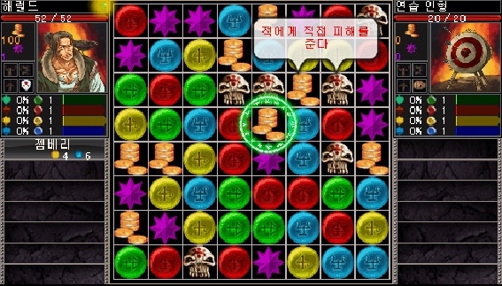

# 퍼즐 퀘스트: 챌린지 오브 더 워로드
### Puzzle Quest: Challenge of the Warlords — PSP 한국어 패치

**PSP · 일본판 기반 · 한국어 패치 완료**

*퍼즐과 RPG가 만나는 판타지 모험을 한국어로 즐겨보세요.*

---

## 🎮 게임 소개

**퍼즐 퀘스트: 챌린지 오브 더 워로드**는 매치 3 퍼즐 전투와 캐릭터 육성, 장비, 마법, 퀘스트를 결합한 판타지 퍼즐 RPG입니다. 보석을 맞춰 마나를 모으고 기술을 사용하면서 모험을 진행합니다.

| 항목 | 내용 |
| --- | --- |
| 게임 | Puzzle Quest: Challenge of the Warlords |
| 일본판 제목 | SIMPLE 2500 シリーズ Portable!! Vol.11 THE パズルクエスト ～アガリアの騎士～ |
| 플랫폼 | PlayStation Portable (PSP) |
| 패치 기준 | 일본판 |
| 일본판 제품 코드 | ULJS-00114 |
| 장르 | 퍼즐 RPG |
| 메타크리틱 | **84/100** (PSP판, 전문가 평가 32건) |
| 한국어 패치 | **완료** |

> 메타크리틱 평점은 게임 원작의 PSP 버전에 대한 평가이며, 한국어 패치의 평점이 아닙니다.

## 🇰🇷 한국어 패치 소개

이 프로젝트는 **PSP 일본판**을 기반으로 원작의 게임 경험을 최대한 유지하면서 한국어로 즐길 수 있도록 제작한 비공식 팬 번역 패치입니다.

**한글화된 항목**
- 메뉴 및 인터페이스
- 대사와 퀘스트
- 각종 설명
- 전투 알림
- 일부 이미지
- 시스템에 표시되는 게임명

**패치 버전:** `v0.9.1` (현재 README에 기록된 배포 파일 기준)  
**배포 파일명:** `PuzzleQuest_PSP_KOR_v0.9.1_patch.zip`

## v0.9.1 변경점

- 목록창의 `소문`을 다른 항목과 같은 크기로 표시합니다.
- 상점 구매·판매 아이템 가격의 `NGOLD` 표시를 수정했습니다.

## 🖼️ 스크린샷

일본판 PSP 게임에 한국어 패치를 적용한 화면입니다.

| 인트로 | 캐릭터 생성 |
| :---: | :---: |
|  |  |
| 대사 | 마법 아이템 |
|  |  |
| 전투 | |
|  | |

## 📦 패치 적용 방법

1. **본인이 소유한 일본판 게임에서 추출한 원본 ISO**를 준비합니다.
2. 아래 SHA-256 해시로 원본 파일이 패치 기준과 일치하는지 확인합니다.
3. 배포 ZIP 파일의 안내에 따라 **xdelta3**로 패치를 적용합니다.
4. 패치가 적용된 ISO의 SHA-256 값을 아래 결과값과 비교합니다.
5. 정상적으로 일치하면 PSP 또는 호환 실행 환경에서 실행합니다.

**패치 기준 원본**
- 원본 식별 파일명: `2ch-s11pq.iso`
- SHA-256: `D0CF1F2699FD9AD5F25AB9BEA8BD1F1DED48BC3661D8D631A780204C1C405A26`

**패치 적용 후 결과**
- SHA-256: `9FC92996B5BD40279715BE088223AE6E12F2FFA5C0CA2A8B279A1FED119706DF`

> 원본 ISO가 위 기준과 다르면 패치가 실패하거나 게임이 정상 동작하지 않을 수 있습니다. 원본 파일은 별도로 백업해 두세요. ZIP 안에 포함된 안내가 있다면 그 안내를 우선 확인하세요.

## 🔎 PSP와 NDS 버전

PSP와 Nintendo DS 버전은 같은 게임을 기반으로 하며, **두 플랫폼의 한국어 패치 모두 완료**되었습니다. 프로젝트의 소개 형식과 방향성은 통일하되, 플랫폼별 원본 파일·패치 파일·적용 절차는 각 저장소에서 별도로 안내합니다.

- **PSP:** 일본판 ISO 기반 xdelta 패치
- **NDS:** 해당 플랫폼 저장소의 배포 안내 참고

[NDS 한국어 패치 프로젝트](https://github.com/YourFaceMonster/puzzle-quest-nds-korean-patch)

## ⚠️ 주의사항

- 이 저장소는 **비공식 팬 번역 프로젝트**이며 원작 개발사 및 배급사와 관계가 없습니다.
- 게임 본편(ISO)은 배포하지 않습니다. 패치 적용에는 사용자가 적법하게 보유한 게임 원본이 필요합니다.
- 한국어 패치는 지정된 일본판 원본을 기준으로 제작되었습니다.
- 다른 지역판이나 다른 해시의 이미지에 대한 호환성은 보장하지 않습니다.

## 🙏 크레딧

**한국어화: YFM**

원작의 개발진과 퍼즐 퀘스트를 즐기는 모든 분들께 감사드립니다.

---

Unofficial Korean translation patch · PlayStation Portable

